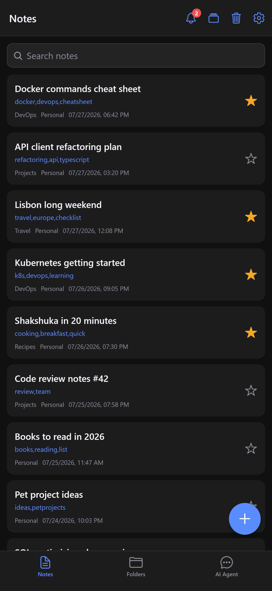
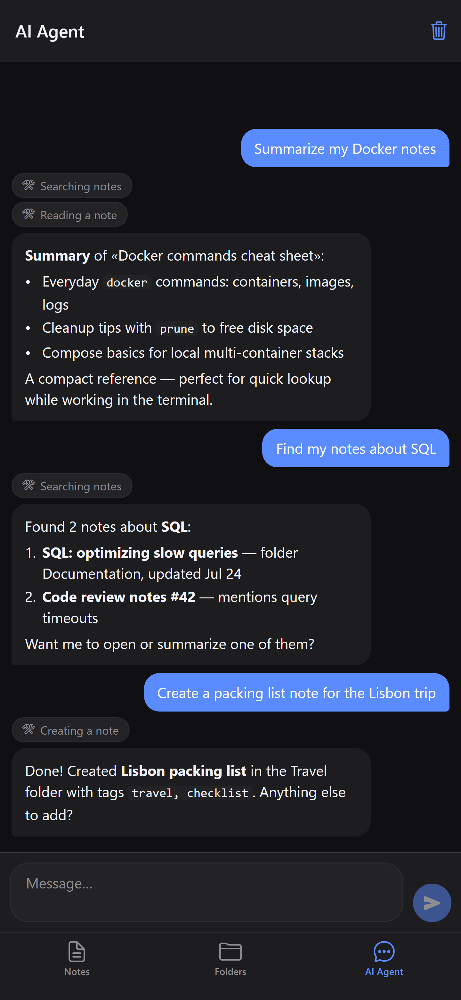
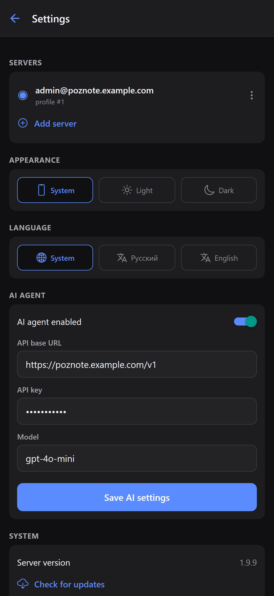

# Pozzy

**An unofficial cross-platform mobile client for the self-hosted [Poznote](https://github.com/timothepoznanski/poznote) note-taking server — iOS & Android.**

[](LICENSE)
[](#getting-started)
[](https://expo.dev)
[](https://reactnative.dev)
[](docs/API-COVERAGE.md)

Pozzy talks to your own Poznote server over its REST API (HTTP Basic Auth + `X-User-ID`) — no cloud, no third parties, your notes stay on your hardware. Built with React Native + Expo (Node.js toolchain), so development and testing run entirely on Windows.

<p align="center">
  
  &nbsp;&nbsp;
  
  &nbsp;&nbsp;
  
</p>

## Features

**Connection**
- First-launch server setup with connection validation (credentials and `/notes` access are checked before saving)
- Multiple saved servers: add, edit, switch, and remove connection profiles
- `X-User-ID` auto-detected from your credentials (`GET /users/me`); manual override for admins
- **App passwords support** (Poznote 6.84+): sign in with your account username and an app password created in `Settings → App passwords` instead of the account password. App passwords are sent over HTTP Basic Auth exactly like the account password, so they work out of the box — including on SSO-only instances where Basic Auth for the API is otherwise disabled
- Light / dark / system theme, persisted
- **Two UI languages: English and Russian** — auto-detected from the system locale, with a manual override in Settings
- **App lock with biometrics or device PIN** (Face ID / fingerprint / system passcode), relocks after 30 s in background (native only)
- **Offline mode**: when the server is unreachable, the app keeps working on a local cache (AsyncStorage, **encrypted at rest**, see [Security](#security)) — you can browse, create, and edit notes; changes are queued and synced automatically once the connection is back (**last-write-wins by modification date** on conflicts). An "offline mode" banner is shown while disconnected
- **Onboarding**: a one-time 3-slide intro (what Pozzy is, key features, how to use the AI agent) shown before any setup; a "seen" flag is stored locally so it never appears again

**Notes**
- List with instant search, workspace and folder filters, pull-to-refresh, and sort by last update
- Multi-select mode: long-press a note → checkboxes, select all, bulk delete
- Editor with **edit-lock** support (safe co-editing with the web UI: acquire, heartbeat, release, conflict banner)
- Create, edit (heading, tags, content), favorite, soft-delete
- **Autosave in the editor** — no save button: changes are persisted automatically (debounced) and flushed when you leave the note
- Duplicate, convert Markdown ↔ HTML, move to folder
- Public share links (create / revoke / send)
- Reminders with quick intervals
- Version history (snapshots) with one-tap restore
- Backlinks viewer
- Attachments: upload, open, delete

**Organization**
- Folders: note counts, create, rename, empty, delete
- Workspaces: quick switcher in the notes list, plus create / rename / delete from the same dialog
- Trash: restore (single or all at once), permanent delete, empty
- Notifications (reminder alerts) with an unread badge
- **Bottom navigation: Notes, Folders, and AI Agent tabs**

**AI Chat**
- Chat tab backed by any OpenAI-compatible API (OpenAI, OpenRouter, Ollama, …)
- Base URL, API key, and model are configured in **Settings → AI chat**; the whole feature can be disabled there
- **Agent mode with tools**: the assistant works with your notes via function calling over the same OpenAI-compatible API (30 tools, see the catalog below)
- Chat history (including tool calls) is persisted on-device (encrypted) and survives app restarts; a header button clears it
- **Two-level memory**: recent messages are sent as-is (short-term), older conversation is compacted by the LLM into a running summary that is injected into the system prompt (long-term); the summary is recomputed only after enough new material accumulates
- Destructive and irreversible actions require explicit user approval in the chat UI
- **Guardrails**: approval for destructive tools, batch caps (50 by default), per-request tool-call budget (25), agent step limit, loop detection (3 identical calls), tool-result truncation (8k chars), 60s request timeout
- The whole AI feature can be turned off with a single switch in Settings

<details>
<summary><strong>AI chat tools catalog</strong></summary>

**Reading**
- `search_notes` — search notes by text with folder/workspace filters (compact list)
- `get_note` — full note content by id or title
- `get_recent_notes` — recently updated notes
- `list_folders` — folders with note counts
- `list_workspaces` — available workspaces
- `list_uncategorized_notes` — notes without a folder
- `get_note_stats` — totals, favorites, counts by folder/workspace, trash count
- `get_backlinks` — notes linking to a given note
- `list_trash` — notes in trash

**Single-note writes**
- `create_note` — create a note (title, content, tags, folder, workspace)
- `update_note` — change title/content/tags of a note
- `append_to_note` — append text to a note
- `search_and_replace` — replace exact text inside a note
- `add_tags` — add tags keeping existing ones
- `toggle_favorite` — toggle favorite
- `duplicate_note` — copy a note
- `convert_note_format` — Markdown ↔ HTML conversion
- `move_note_to_folder` / `move_note_to_workspace` — relocate a note
- `merge_notes` — combine several notes into one (sources go to trash)
- `restore_note` — restore from trash
- `delete_note` 🔒 — move a note to trash

**Folders & batch operations**
- `create_folder` / `rename_folder` — folder management
- `move_notes_by_query` — move all matching notes to a folder (with date filters)
- `tag_notes_by_query` — add/replace tags on all matching notes
- `empty_folder` 🔒 — move all folder's notes to trash
- `delete_folder` 🔒 — delete a folder (notes become uncategorized)
- `delete_notes_by_query` 🔒 — move all matching notes to trash
- `empty_trash` 🔒 — permanently delete everything in trash

🔒 = requires explicit user approval before execution. Batch tools are capped (50 by default) and return a report of affected notes.

</details>

**Server management (in Settings)**
- Server version and update check
- Git Sync: status, connection test (with decoded server errors), push, pull
- Backups: list, create, delete
- Active public share links

**API coverage:** 100 client calls, all verified against the Poznote OpenAPI spec — see [docs/API-COVERAGE.md](docs/API-COVERAGE.md) (including a list of spec ↔ server discrepancies found along the way).

## Security

Pozzy never stores a secret or note content on disk in plain text. Secrets live in the platform keystore. Everything else that is sensitive is encrypted before it reaches AsyncStorage or the file system. All of it goes through one module, [`src/storage/secure/`](src/storage/secure/index.ts): the rest of the app never calls SecureStore directly and never writes sensitive data to AsyncStorage.

**What is stored where**

| Data | Storage | Protection |
|---|---|---|
| Server password or app password, per server profile | SecureStore `pozzy.server.<id>.password` | iOS Keychain / Android Keystore |
| AI provider API key | SecureStore `pozzy.ai.default.apiKey` | iOS Keychain / Android Keystore |
| Data keys: one per server, one for app-wide data | SecureStore `pozzy.server.<id>.dek`, `pozzy.app.dek` | 256-bit random keys from the platform CSPRNG (`expo-crypto`) |
| Offline cache: notes list, folders, full notes | AsyncStorage `pozzy.cache.<id>.meta`, `pozzy.cache.<id>.note.<noteId>` | XChaCha20-Poly1305 with the server data key |
| Queue of unsynced edits, with the temporary-to-server id map | AsyncStorage `pozzy.cache.<id>.queue` | XChaCha20-Poly1305 with the server data key |
| AI chat history and summary, custom note templates | AsyncStorage `poznote.chatHistory.v1`, `poznote.chatSummary.v1`, `pozzy.templates.v1` | XChaCha20-Poly1305 with the app data key |
| Attachments waiting for upload | `documentDirectory/pending-attachments/<id>/<opId>.enc` | XChaCha20-Poly1305 with the server data key. The file name exists only inside the encrypted queue |
| Server URL, username, profile ID, theme, language, selected workspace, app-lock and onboarding flags | AsyncStorage | Not secret, stored as is |

**How it is protected**

- SecureStore entries use `AFTER_FIRST_UNLOCK_THIS_DEVICE_ONLY`. They are readable after the first unlock, so a future background sync can use them, and they never move to another device.
- `requireAuthentication` is intentionally **not** used. Binding keys to biometrics would break background work, and re-enrolling a fingerprint would destroy the keys. The biometric app lock stays a UI-level gate.
- Every cached value is encrypted on its own with [`@noble/ciphers`](https://github.com/paulmillr/noble-ciphers), an audited pure-JS library. The same code runs on iOS, Android, web and in Jest.
- Each write uses a fresh random 24-byte nonce. The storage key is the associated data, so a value cannot be moved under another key unnoticed.
- The envelope format is `enc:v1:<base64(nonce | ciphertext | tag)>`. A value without the `enc:` prefix is legacy plain text and is re-encrypted as soon as it is read.
- The cache keeps per-note granularity. Editing one note re-encrypts only that note and the queue, in a single `multiSet`, queue first. The id map for notes created offline lives in the same record as the queue, so a crash between entries cannot separate them.
- A read error from the keystore is retried. A secret that could not be read is never deleted by a later save.
- Secrets, data keys and note content are never logged. Errors from the crypto layer never contain data.

**Upgrading from 1.0.x.** On the first start after the update, before any sync, a one-time migration runs. It moves passwords and the API key to SecureStore. It encrypts the unsynced-edit queue first, then the rest of the offline cache, queued attachment files, chat history and templates. Every item follows the same order: read the original, write the new form, read it back and compare, and only then delete the plain-text original. An interruption at any point is safe, and the migration resumes on the next launch. The version flag `pozzy.migration.v1` is set only after every step has succeeded.

**Backups, new devices and reinstalls**

- **Android Auto Backup.** The `expo-secure-store` config plugin (`configureAndroidBackup: true` in `app.json`) excludes SecureStore from cloud backup and device transfer. Its rules include only shared preferences, so the AsyncStorage database and queued attachment files are not backed up either.
- **iOS backup or a new device.** Keychain items are device-only, so a restored app can have the encrypted cache without its keys.
- **Missing or unreadable data key.** The encrypted cache for that server is treated as lost: it is wiped and downloaded from the server again. The app never crashes. If unsynced edits were lost, the user sees a clear message once. Passwords have to be entered again.
- **Reinstall on iOS.** The Keychain survives app deletion. On a fresh install, with no install marker and no app data in AsyncStorage, Pozzy deletes every `pozzy.*` SecureStore entry left by the previous install. SecureStore cannot list its entries, so Pozzy keeps its own key index in `pozzy.keys`.
- **Removing a server profile** deletes its password, data key, cache, queue and queued attachment files.

**Web build.** `expo-secure-store` is not available in browsers. On the web, secrets are kept in memory only, so the password has to be entered again after a page reload. The offline cache and chat history live only for the session. Custom note templates stay in `localStorage` as before, because a browser has no safe place for the key that would encrypt them. Unsynced edits made by an older version stay in `localStorage` until they are synced, then they are removed.

**Known limits**

- Opening an attachment writes a plain copy to the cache directory, because the system share sheet hands the file to another app. These copies are deleted on the next app start.
- Scheduled reminder notifications contain the note title, which the OS keeps in its own notification store.
- Encryption at rest protects data on disk and in backups. It does not protect against malware running on an unlocked, rooted or jailbroken device.
- Attachment files are encrypted in memory in JS, so very large files use noticeable memory while they are queued or uploaded.

Unit tests for this layer live in `src/storage/secure/__tests__/`, `src/storage/__tests__/offlineStore.test.ts` and `src/data/__tests__/attachments.test.ts`. They include a migration run that is interrupted at every single storage operation. The on-device checklist is in [docs/SECURITY-TESTING.md](docs/SECURITY-TESTING.md).

## Getting started

### Prerequisites

- Node.js 24+ and npm (the lockfile is generated by npm 12 — older npm versions fail `npm ci` on it)
- For a phone or an emulator: a [development build](https://docs.expo.dev/develop/development-builds/introduction/) (Android Studio or Xcode). **Expo Go is not enough**: the app uses native modules that Expo Go does not ship (speech recognition, share intent, quick actions)
- Network access to your Poznote server from the device/browser

### Run

```bash
git clone https://github.com/blanergol/pozzy.git pozzy
cd pozzy
npm install
npm start
```

Then pick your target:

- **Android device or emulator:** `npm run android` builds and installs the development build (`expo run:android`), then connects it to the dev server. Phone and PC must be on the same network.
- **iOS device or simulator (macOS):** `npm run ios`.
- **Browser on Windows:** press `w` (or `npm run web`) — the app opens as a web page. See [Security](#security) for how the web build handles secrets.

### First-launch setup

1. **Server URL** — e.g. `https://poznote.example.com` (the `https://` scheme is added automatically if omitted).
2. **Login and password** — your Poznote credentials (HTTP Basic Auth). On Poznote 6.84+ you can use an [app password](https://github.com/timothepoznanski/poznote/blob/main/docs/API-REST.md#authentication) instead of the account password — recommended for mobile clients, and the only option on SSO-only instances.
3. **Profile ID** — leave empty: it is auto-detected from your credentials. Fill it in manually only to act as another profile (requires admin credentials).

Tap **“Check & save”**: the app validates the credentials and `/api/v1/notes` access, then stores the profile. You can save multiple servers and switch between them in **Settings → Servers**.

## Testing

```bash
npx tsc --noEmit                    # TypeScript
npx jest                            # unit tests (136)
npx expo export                     # production bundles for web/iOS/Android
node scripts/mock-server.js 8901 &  # stateful mock of the Poznote API
node scripts/e2e.js                 # end-to-end walkthrough (needs expo web on :8081) — 63 checks
```

CI/CD (GitHub Actions, see [docs/CI-RELEASE.md](docs/CI-RELEASE.md)): pushes and PRs to `master` run type-check + unit tests; pushing a `v*` tag additionally builds a signed Android APK and publishes it as a GitHub Release.

The E2E suite (`scripts/e2e.js`) drives the real app in a browser via Playwright against a full stateful mock of the Poznote API (`scripts/mock-server.js`): connection, search, workspaces, notifications, every editor action, folders, trash, multi-select, and settings. Reset the mock between runs with `GET /__reset`. For the demo dataset used in the screenshots above, run the mock with `node scripts/mock-server.js 8902 showcase` (and `scripts/screenshots-store.js` to regenerate them — 1440×3120, store-ready).

## Project structure

```
App.tsx                              — navigation (root stack + bottom tabs: Notes / Folders / AI Chat), app entry
src/theme/ThemeContext.tsx           — light/dark palettes, system theme
src/i18n/                            — ru/en dictionaries + provider (system locale, persisted)
src/api/client.ts                    — Poznote HTTP client (Basic Auth + X-User-ID), 100 API calls
src/api/chat.ts                      — OpenAI-compatible chat client (/chat/completions + function calling)
src/chat/agent.ts                    — agent loop (model ↔ tools, step limit, approval)
src/chat/tools/                      — Poznote tools for the AI chat (search/read/create/update/move/delete)
src/chat/memory.ts                   — two-level memory (recent messages + LLM-compacted summary)
src/api/types.ts                     — API types (matching real server responses)
src/context/SettingsContext.tsx      — server profiles, active server, theme, workspace
src/context/ConnectivityContext.tsx  — online/offline status (netinfo) + manual override
src/storage/settings.ts              — settings: servers (passwords in SecureStore), theme, workspace, AI
src/storage/offlineStore.ts          — offline cache: notes snapshot + pending-changes queue (encrypted, per note)
src/storage/secure/                  — secrets (SecureStore), encrypted cache and attachment files, startup migration
src/components/LostEditsNotice.tsx   — one-time message when unsynced offline edits could not be recovered
src/data/notesRepository.ts          — offline-first notes data layer (cache ⇄ API)
src/data/sync.ts                     — sync of queued changes on reconnect (last-write-wins by date)
src/components/OfflineBanner.tsx     — "offline mode" banner
src/components/SyncManager.tsx       — triggers sync when connectivity returns
src/components/ActionSheet.tsx       — bottom-sheet menus (Alert is limited on Android)
src/components/DialogProvider.tsx    — cross-platform dialogs (RN-web Alert is a no-op)
src/components/AttachmentsModal.tsx  — note attachments
src/components/MarkdownText.tsx      — Markdown rendering (+ src/components/markdownParser.ts)
src/screens/OnboardingScreen.tsx     — one-time 3-slide intro shown on first launch
src/screens/SettingsScreen.tsx       — servers, theme, system, Git Sync, backups, share links, AI chat
src/screens/NotesListScreen.tsx      — notes list (search, filters, multi-select, badge)
src/screens/NoteEditorScreen.tsx     — editor (autosave, edit-lock, actions, snapshots, backlinks)
src/screens/FoldersScreen.tsx        — folders
src/screens/ChatScreen.tsx           — AI chat (OpenAI-compatible API)
src/screens/TrashScreen.tsx          — trash
src/screens/NotificationsScreen.tsx  — notifications (reminders)
plugins/withReleaseSigning.js        — Expo config plugin: release APK signing from CI secrets
scripts/mock-server.js               — stateful Poznote API mock (port 8901)
scripts/e2e.js                       — Playwright E2E suite
docs/openapi.yaml                    — vendored Poznote OpenAPI spec
docs/API-COVERAGE.md                 — API coverage checklist + spec/server discrepancies
docs/CI-RELEASE.md                   — CI/CD: tests on push/PR, signed APK release on v* tags
docs/SECURITY-TESTING.md             — manual checklist: secure storage, encryption, upgrade and backups
```

## Troubleshooting

**Self-signed / internal CA certificates.** If your server uses HTTPS with a private CA, that CA must be trusted by the phone, or requests will fail. In a browser, opening the server URL once and accepting the certificate is enough.

**CORS (web builds only).** Poznote's preflight response does not include `X-User-ID` in `Access-Control-Allow-Headers` (upstream bug, `src/api/v1/index.php`). Browsers therefore block data endpoints; native apps are unaffected. The one-line fix on the server:

```bash
docker exec <poznote-container> sed -i "s|Access-Control-Allow-Headers: Content-Type, Authorization|Access-Control-Allow-Headers: Content-Type, Authorization, X-User-ID|" /var/www/html/api/v1/index.php
```

## Known spec discrepancies

While building the client we found several places where Poznote's OpenAPI spec differs from the actual server responses (field names, status codes, CORS headers). The client follows the real server behavior; all findings are documented in [docs/API-COVERAGE.md](docs/API-COVERAGE.md) and are good candidates for upstream fixes.

## Contributing

Issues and pull requests are welcome. Please run `npx tsc --noEmit` and the E2E suite before submitting a PR.

## Acknowledgments

- [Poznote](https://github.com/timothepoznanski/poznote) — the self-hosted note-taking server this client is built for (all credit for the API and server to its authors).
- Built with [Expo](https://expo.dev) and [React Native](https://reactnative.dev).

## License

[MIT](LICENSE) © Pozzy contributors. This is an unofficial client and is not affiliated with the Poznote project.
