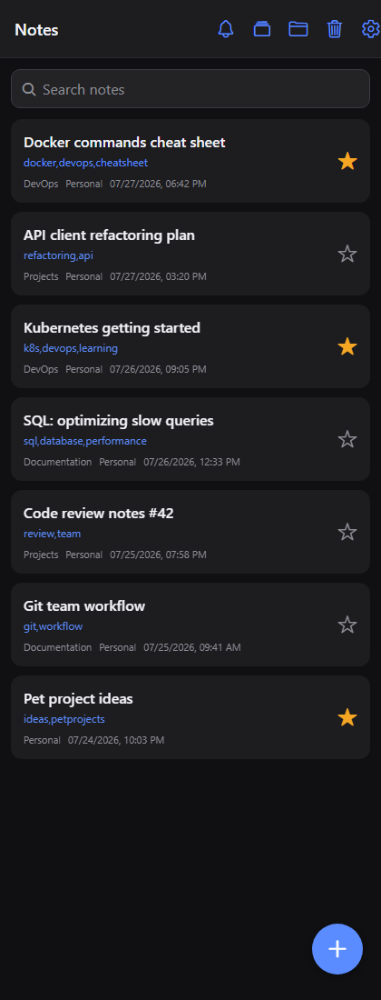
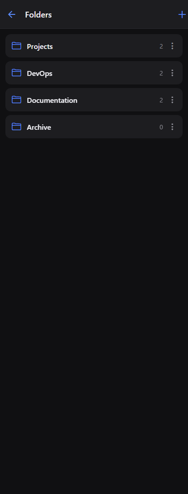
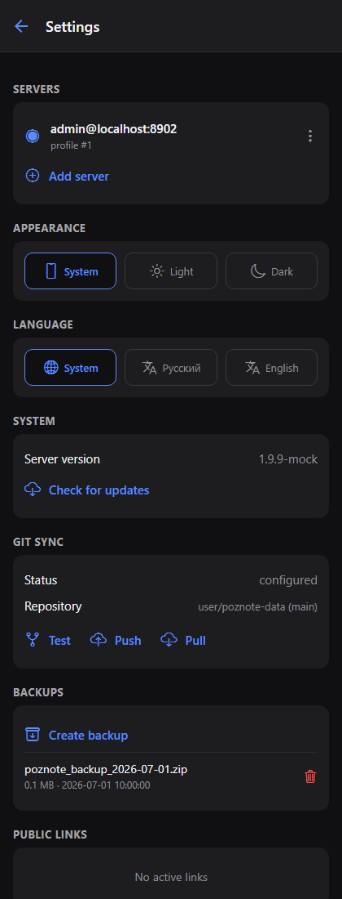

# Pozzy

**An unofficial cross-platform mobile client for the self-hosted [Poznote](https://github.com/timothepoznanski/poznote) note-taking server — iOS, Android, and a one-command web build for quick testing on Windows.**

[](LICENSE)
[](#getting-started)
[](https://expo.dev)
[](https://reactnative.dev)
[](docs/API-COVERAGE.md)

Pozzy talks to your own Poznote server over its REST API (HTTP Basic Auth + `X-User-ID`) — no cloud, no third parties, your notes stay on your hardware. Built with React Native + Expo (Node.js toolchain), so development and testing run entirely on Windows.

<p>
  
  &nbsp;
  
  &nbsp;
  
</p>

## Features

**Connection**
- First-launch server setup with connection validation (credentials and `/notes` access are checked before saving)
- Multiple saved servers: add, edit, switch, and remove connection profiles
- `X-User-ID` auto-detected from your credentials (`GET /users/me`); manual override for admins
- Light / dark / system theme, persisted
- **Two UI languages: English and Russian** — auto-detected from the system locale, with a manual override in Settings
- **App lock with biometrics or device PIN** (Face ID / fingerprint / system passcode), relocks after 30 s in background (native only)

**Notes**
- List with instant search, workspace and folder filters, pull-to-refresh, and sort by last update
- Multi-select mode: long-press a note → checkboxes, select all, bulk delete
- Editor with **edit-lock** support (safe co-editing with the web UI: acquire, heartbeat, release, conflict banner)
- Create, edit (heading, tags, content), favorite, soft-delete
- Duplicate, convert Markdown ↔ HTML, move to folder
- Public share links (create / revoke / send)
- Reminders with quick intervals
- Version history (snapshots) with one-tap restore
- Backlinks viewer
- Attachments: upload, open, delete

**Organization**
- Folders: note counts, create, rename, empty, delete
- Workspaces: quick switcher in the notes list, plus create / rename / delete from the same dialog
- Trash: restore (single or all at once), permanent delete, empty
- Notifications (reminder alerts) with an unread badge
- **Bottom navigation: Notes, Folders, and AI Agent tabs**

**AI Chat**
- Chat tab backed by any OpenAI-compatible API (OpenAI, OpenRouter, Ollama, …)
- Base URL, API key, and model are configured in **Settings → AI chat**; the whole feature can be disabled there
- **Agent mode with tools**: the assistant works with your notes via function calling over the same OpenAI-compatible API (30 tools, see the catalog below)
- Chat history (including tool calls) is persisted on-device and survives app restarts; a header button clears it
- **Two-level memory**: recent messages are sent as-is (short-term), older conversation is compacted by the LLM into a running summary that is injected into the system prompt (long-term); the summary is recomputed only after enough new material accumulates
- Destructive and irreversible actions require explicit user approval in the chat UI
- **Guardrails**: approval for destructive tools, batch caps (50 by default), per-request tool-call budget (25), agent step limit, loop detection (3 identical calls), tool-result truncation (8k chars), 60s request timeout
- The whole AI feature can be turned off with a single switch in Settings

<details>
<summary><strong>AI chat tools catalog</strong></summary>

**Reading**
- `search_notes` — search notes by text with folder/workspace filters (compact list)
- `get_note` — full note content by id or title
- `get_recent_notes` — recently updated notes
- `list_folders` — folders with note counts
- `list_workspaces` — available workspaces
- `list_uncategorized_notes` — notes without a folder
- `get_note_stats` — totals, favorites, counts by folder/workspace, trash count
- `get_backlinks` — notes linking to a given note
- `list_trash` — notes in trash

**Single-note writes**
- `create_note` — create a note (title, content, tags, folder, workspace)
- `update_note` — change title/content/tags of a note
- `append_to_note` — append text to a note
- `search_and_replace` — replace exact text inside a note
- `add_tags` — add tags keeping existing ones
- `toggle_favorite` — toggle favorite
- `duplicate_note` — copy a note
- `convert_note_format` — Markdown ↔ HTML conversion
- `move_note_to_folder` / `move_note_to_workspace` — relocate a note
- `merge_notes` — combine several notes into one (sources go to trash)
- `restore_note` — restore from trash
- `delete_note` 🔒 — move a note to trash

**Folders & batch operations**
- `create_folder` / `rename_folder` — folder management
- `move_notes_by_query` — move all matching notes to a folder (with date filters)
- `tag_notes_by_query` — add/replace tags on all matching notes
- `empty_folder` 🔒 — move all folder's notes to trash
- `delete_folder` 🔒 — delete a folder (notes become uncategorized)
- `delete_notes_by_query` 🔒 — move all matching notes to trash
- `empty_trash` 🔒 — permanently delete everything in trash

🔒 = requires explicit user approval before execution. Batch tools are capped (50 by default) and return a report of affected notes.

</details>

**Server management (in Settings)**
- Server version and update check
- Git Sync: status, connection test (with decoded server errors), push, pull
- Backups: list, create, delete
- Active public share links

**API coverage:** 100 client calls, all verified against the Poznote OpenAPI spec — see [docs/API-COVERAGE.md](docs/API-COVERAGE.md) (including a list of spec ↔ server discrepancies found along the way).

## Getting started

### Prerequisites

- Node.js 20+ and npm
- [Expo Go](https://expo.dev/go) on your phone (App Store / Google Play) for on-device testing
- Network access to your Poznote server from the device/browser

### Run

```bash
git clone https://github.com/blanergol/pozzy.git pozzy
cd pozzy
npm install
npm start
```

Then pick your target:

- **Phone (recommended):** scan the QR code with Expo Go. Phone and PC must be on the same network.
- **Browser on Windows:** press `w` (or `npm run web`) — the app opens as a web page.
- **Android emulator:** press `a` (requires Android Studio with an emulator).

### First-launch setup

1. **Server URL** — e.g. `https://poznote.example.com` (the `https://` scheme is added automatically if omitted).
2. **Login and password** — your Poznote credentials (HTTP Basic Auth).
3. **Profile ID** — leave empty: it is auto-detected from your credentials. Fill it in manually only to act as another profile (requires admin credentials).

Tap **“Check & save”**: the app validates the credentials and `/api/v1/notes` access, then stores the profile. You can save multiple servers and switch between them in **Settings → Servers**.

## Testing

```bash
npx tsc --noEmit                    # TypeScript
npx expo export                     # production bundles for web/iOS/Android
node scripts/mock-server.js 8901 &  # stateful mock of the Poznote API
node scripts/e2e.js                 # end-to-end walkthrough (needs expo web on :8081) — 40 checks
```

The E2E suite (`scripts/e2e.js`) drives the real app in a browser via Playwright against a full stateful mock of the Poznote API (`scripts/mock-server.js`): connection, search, workspaces, notifications, every editor action, folders, trash, multi-select, and settings. Reset the mock between runs with `GET /__reset`. For the demo dataset used in the screenshots above, run the mock with `node scripts/mock-server.js 8902 showcase` (and `scripts/screenshots.js` to regenerate them).

## Project structure

```
App.tsx                              — navigation (root stack + bottom tabs: Notes / Folders / AI Chat), app entry
src/theme/ThemeContext.tsx           — light/dark palettes, system theme
src/i18n/                            — ru/en dictionaries + provider (system locale, persisted)
src/api/client.ts                    — Poznote HTTP client (Basic Auth + X-User-ID), 100 API calls
src/api/chat.ts                      — OpenAI-compatible chat client (/chat/completions + function calling)
src/chat/agent.ts                    — agent loop (model ↔ tools, step limit, approval)
src/chat/tools.ts                    — Poznote tools for the AI chat (search/read/create/update/move/delete)
src/api/types.ts                     — API types (matching real server responses)
src/context/SettingsContext.tsx      — server profiles, active server, theme, workspace
src/storage/settings.ts              — persistence (AsyncStorage): servers, theme, workspace
src/components/ActionSheet.tsx       — bottom-sheet menus (Alert is limited on Android)
src/components/DialogProvider.tsx    — cross-platform dialogs (RN-web Alert is a no-op)
src/components/AttachmentsModal.tsx  — note attachments
src/screens/SettingsScreen.tsx       — servers, theme, system, Git Sync, backups, share links, AI chat
src/screens/NotesListScreen.tsx      — notes list (search, filters, multi-select, badge)
src/screens/NoteEditorScreen.tsx     — editor (edit-lock, actions, snapshots, backlinks)
src/screens/FoldersScreen.tsx        — folders
src/screens/ChatScreen.tsx           — AI chat (OpenAI-compatible API)
src/screens/TrashScreen.tsx          — trash
src/screens/NotificationsScreen.tsx  — notifications (reminders)
scripts/mock-server.js               — stateful Poznote API mock (port 8901)
scripts/e2e.js                       — Playwright E2E suite
docs/openapi.yaml                    — vendored Poznote OpenAPI spec
docs/API-COVERAGE.md                 — API coverage checklist + spec/server discrepancies
```

## Troubleshooting

**Self-signed / internal CA certificates.** If your server uses HTTPS with a private CA, that CA must be trusted by the phone, or requests will fail. In a browser, opening the server URL once and accepting the certificate is enough.

**CORS (web builds only).** Poznote's preflight response does not include `X-User-ID` in `Access-Control-Allow-Headers` (upstream bug, `src/api/v1/index.php`). Browsers therefore block data endpoints; native apps are unaffected. The one-line fix on the server:

```bash
docker exec <poznote-container> sed -i "s|Access-Control-Allow-Headers: Content-Type, Authorization|Access-Control-Allow-Headers: Content-Type, Authorization, X-User-ID|" /var/www/html/api/v1/index.php
```

## Known spec discrepancies

While building the client we found several places where Poznote's OpenAPI spec differs from the actual server responses (field names, status codes, CORS headers). The client follows the real server behavior; all findings are documented in [docs/API-COVERAGE.md](docs/API-COVERAGE.md) and are good candidates for upstream fixes.

## Contributing

Issues and pull requests are welcome. Please run `npx tsc --noEmit` and the E2E suite before submitting a PR.

## Support the project

Pozzy is free and open source. If it saves you time, you can support development with a USDT transfer on the TON network (no memo required):

```
UQBC2cFoZ94jsJil-AhmL2HalKZoRikv50UVtzAdSRj05qCk
```

## Acknowledgments

- [Poznote](https://github.com/timothepoznanski/poznote) — the self-hosted note-taking server this client is built for (all credit for the API and server to its authors).
- Built with [Expo](https://expo.dev) and [React Native](https://reactnative.dev).

## License

[MIT](LICENSE) © Pozzy contributors. This is an unofficial client and is not affiliated with the Poznote project.
